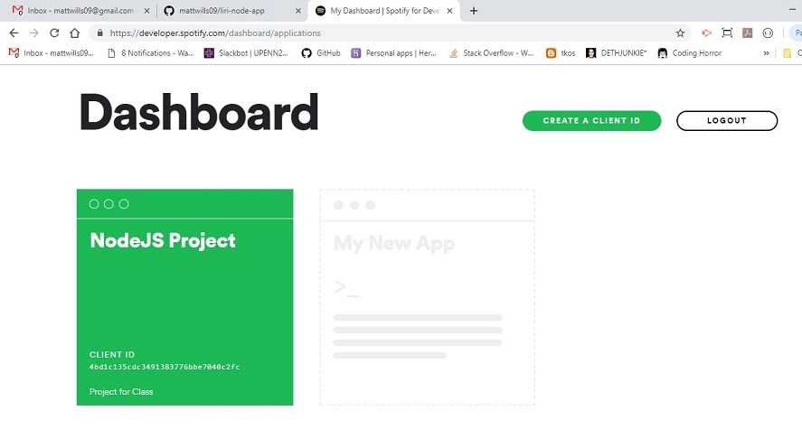
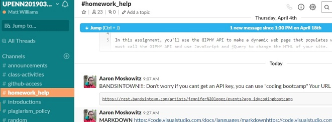
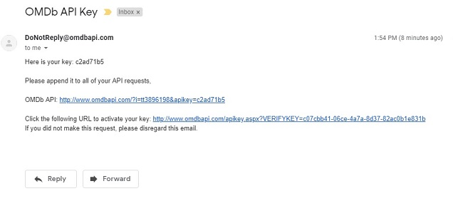
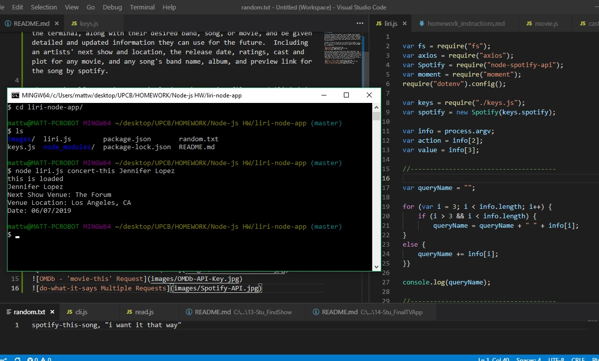
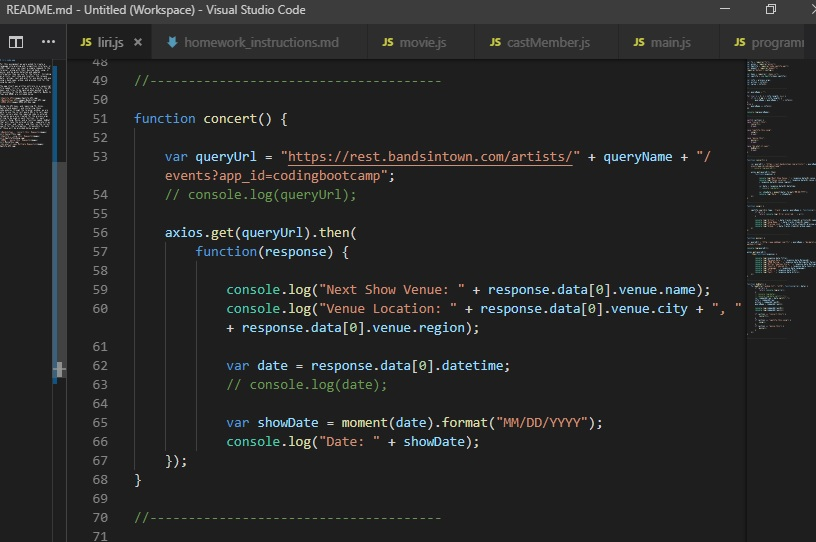
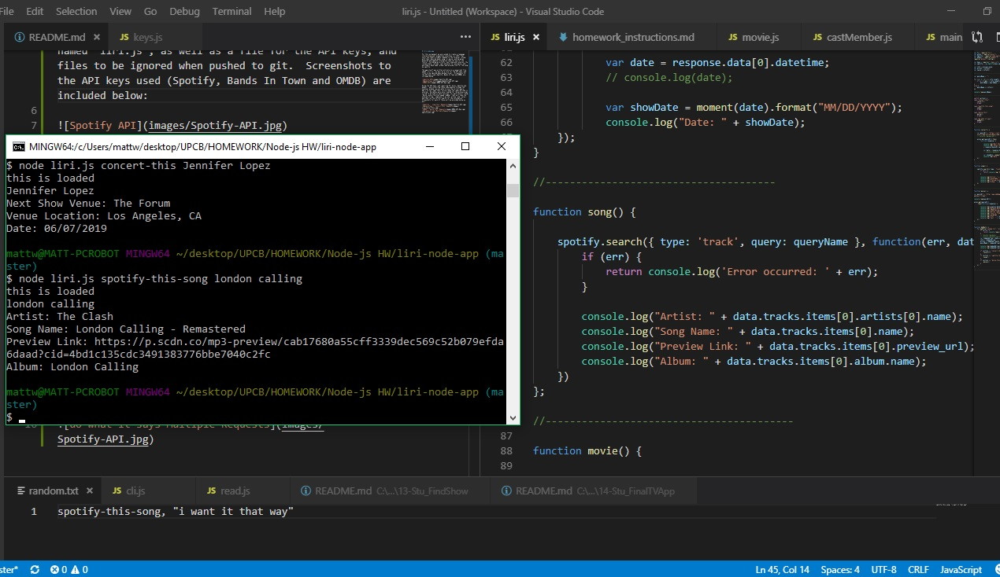
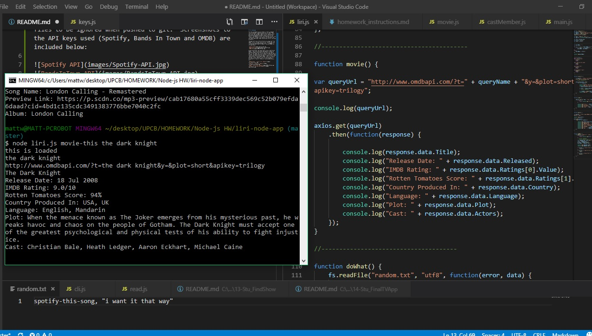
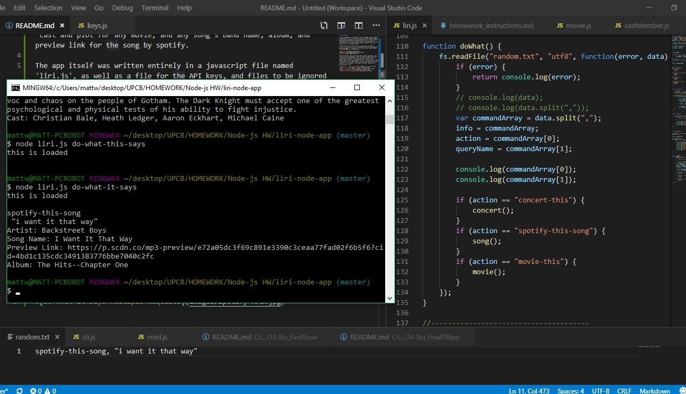
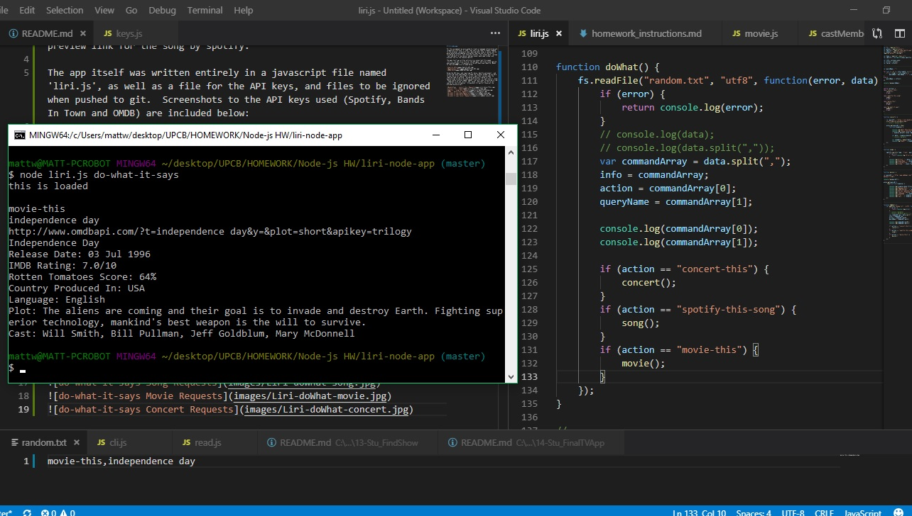
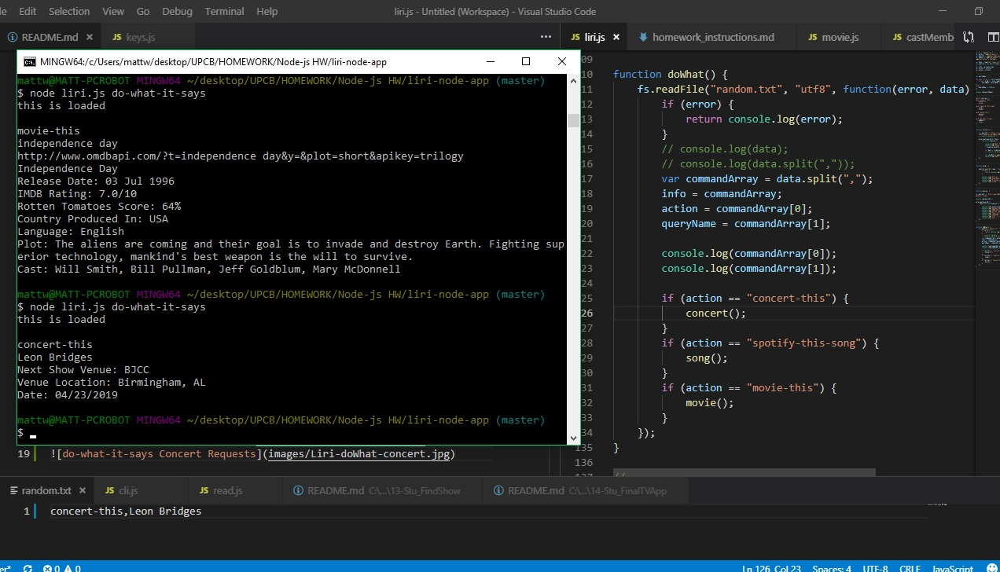

# Liri-Node-Terminal-App

For this assignment we were asked to create a language interpreting and recognition interface, or LIRI, that users could input a simple command to the terminal, along with a desired band/artist, song, or movie, and be given detailed and updated information specific to that search that they can use for the future.  Included searches are an artists' next show and location provided by Bands In Town, a movie's release date, ratings, cast and plot for any movie provided by OMDb, and any song's band name, album, and preview link for the song provided by spotify.

The app itself was written entirely in a javascript file named 'liri.js', as well as separate files for the API keys, and files to be ignored when pushed to git.  Screenshots to the API keys used (Spotify, Bands In Town and OMDB) are included below:

Using the API keys, and requiring FS, Axios, Spotify and moment - and installing those node-modules through the terminal window - the user is able to use the correct query URL's to call upon their servers when the required code is entered.  Variables were also created for the process.argv string to be used in each function, for each Concert, Song, Movie, and a function named 'doWhat' that will take the entered string - separate it as the 'action' and 'value', and then run the correct search for the information.  There were also default values set for the 'movie' and 'song' searches as well when no term is used for the search.  Screenshots for each of those will be provided below:

Throughout this project, the aspects that I found to go smoothy was finding, downloading and implementing the API keys, calling the query URLs, and setting variables to be used for the functions.  The bugs that I had encountered with this project was after writing the function code for the 'concert', 'song', and 'movie', and then figuring out how the code for those would be added to the 'doWhat' function.  Not wanting to copy and paste long lines of code over again, I sat with Buzz and Aaron both to end up writing one 'querySearch' that can be added in each function (to shorten each), and then be able to call those functions in the 'doWhat' function without having to add excess code.  After that edit was made to the liri.js file, the project became much easier to understand through the code, and also with implementing each function.  In the future, the ability for all the information found through each search will be appended to a txt file for the users' records.
